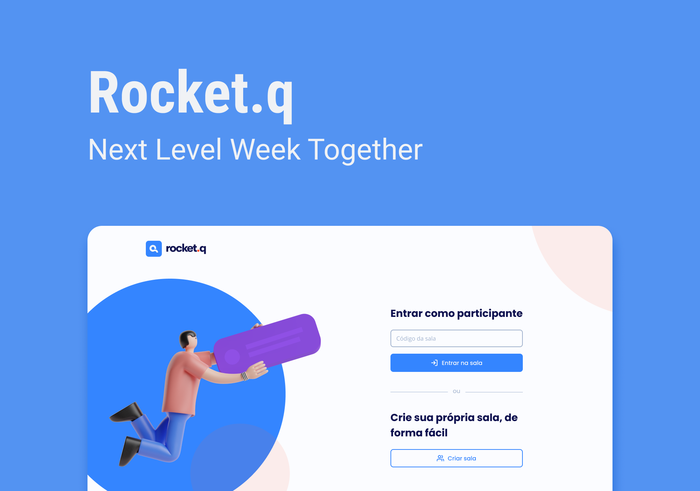

# RocketQ
Aplicação de interação através de perguntas, sendo possível criar uma sala para internautas anônimos fazerem perguntas e o criador da sala em posse de uma senha gerenciar essas perguntas e marcar como lidas.

<div align="center">
    
</div>

## 🚀 Tecnologias

Esse projeto foi desenvolvido com as seguintes tecnologias:

- HTML
- CSS
- JavaScript

##  NodeJS

- [NodeJS](https://nodejs.org/en/)
- [EJS](https://ejs.co)
- [Express](https://www.npmjs.com/package/express)
- [SQLite](https://www.npmjs.com/package/sqlite)
- [Nodemon](https://www.npmjs.com/package/nodemon) (Dependência DEV)

## 💻 Acesse o projeto online

- https://rocketq.onrender.com/

## 💻 Acesse o projeto local

### :white_check_mark: Requisitos ###

Antes de começar :checkered_flag:, você precisa ter o [Git](https://git-scm.com) e o [Node](https://nodejs.org/en/) instalados.

### :checkered_flag: Começo ###

```bash
# Clone o projeto
$ git clone https://github.com/mateussantanasilva/RocketQ.git

# Acesse
$ cd RocketQ/

# Instale as dependências
$ npm install

# Crie o bando de dados
$ npm run iniDb

# Execute o projeto
$ npm start

# O servidor será inicializado e poderá ser acessado por: <http://localhost:3000>
```
